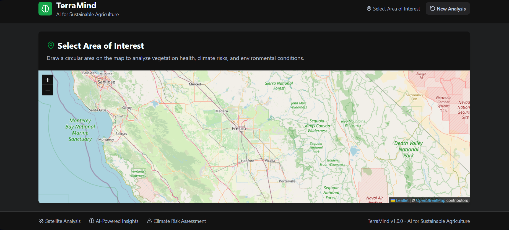
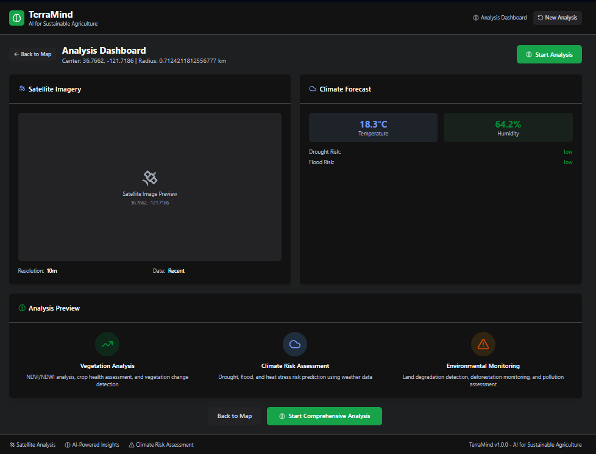
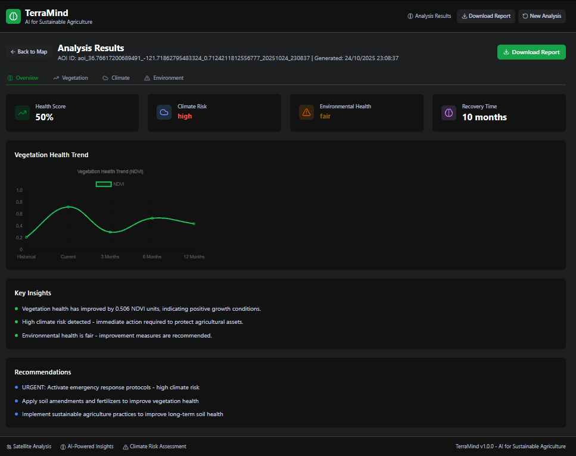
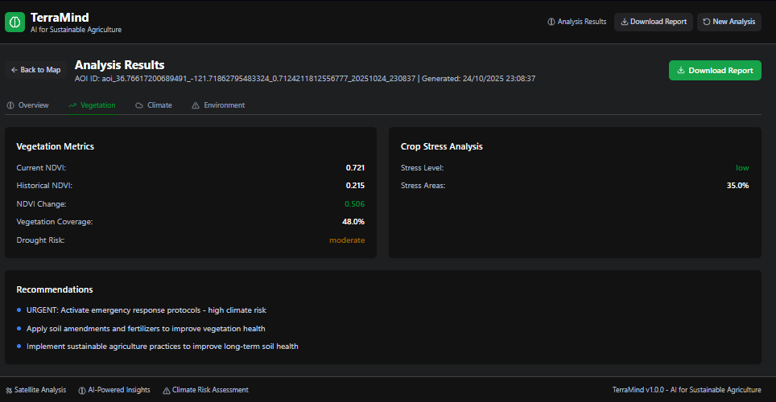
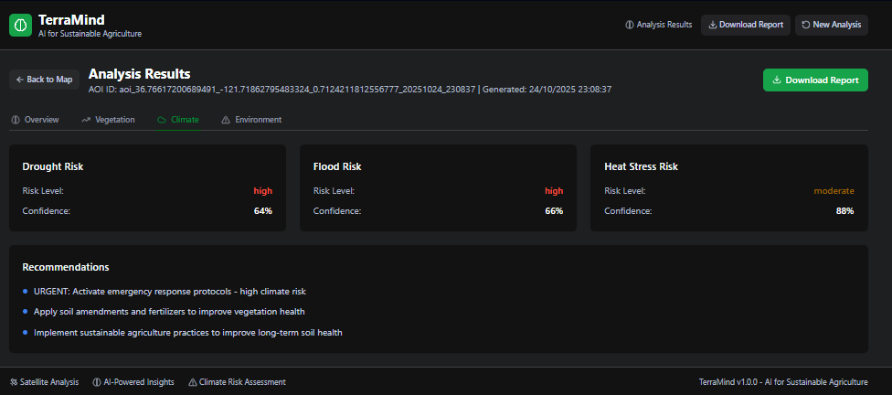
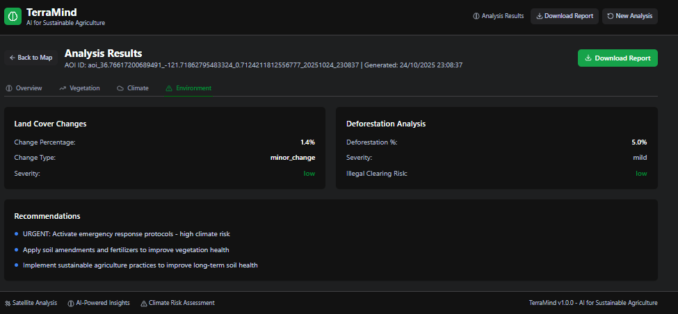
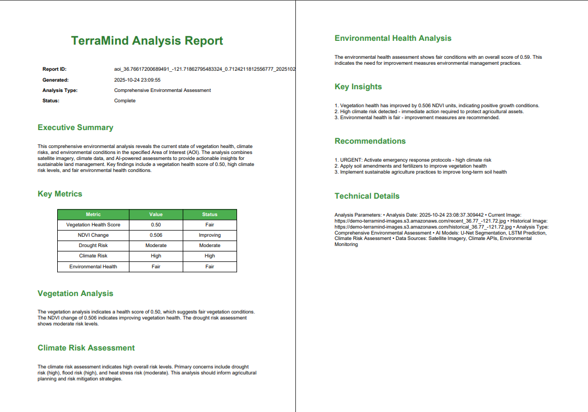

# TerraMind, the AI for sustainable agriculture

**TerraMind** is an AI-powered environmental intelligence platform that helps farmers, researchers, and policymakers monitor, analyze, and predict land and crop health using satellite imagery, climate data, and machine learning

## features

- **Interactive Map Interface**: Draw circular Areas of Interest (AOI) on satellite imagery
- **Dual Image Analysis**: Compare current vs. 12-month-old satellite images
- **AI-Powered Analysis**: 
  - AgroVision: Vegetation health, NDVI/NDWI analysis, crop stress detection
  - EcoGuard: Deforestation and land degradation detection
  - ClimaRisk: Weather risk prediction using climate data
- **Predictive Analytics**: LSTM/Prophet models for future vegetation conditions
- **Automated Insights**: AI-generated recommendations and eco-actions
- **PDF Reports**: Comprehensive reports with maps, analysis, and recommendations

## Project Structure

```
terramind/
├── frontend/                     # react + leaflet + tailwindCSS
│   ├── src/
│   │   ├── components/           # react components
│   │   ├── App.js                # main application
│   │   └── index.js              # entry point
│   ├── public/                   # static assets
│   └── package.json              # dependencies
├── backend/                      # FastAPI + AI/ML modules
│   ├── modules/                  # AI analysis modules
│   │   ├── agrovision.py         # vegetation analysis
│   │   ├── ecoguard.py           # environmental monitoring
│   │   ├── climarisk.py          # climate risk assessment
│   │   ├── insight_engine.py     # recommendations
│   │   ├── satellite_api.py      # satellite imagery
│   │   └── report_generator.py   # PDF reports
│   ├── main.py                   # FastAPI application
│   └── requirements.txt          # python dependencies
├── models/                       # pre-trained AI models
├── data/                         # sample data and cache
├── reports/                      # generated PDF reports
├── docker-compose.yml            # docker configuration
├── setup.sh                      # linux/mac setup script
├── setup.bat                     # windows setup script
└── README.md                     # this file
```

## QuickStart

### Option 1: automated setup

**Linux/Mac:**
```bash
chmod +x setup.sh
./setup.sh
```

**Windows:**
```cmd
setup.bat
```

### Option 2: Manual Setup

#### Prerequisites
- Python 3.8+ 
- Node.js 16+
- Git

#### Backend Setup
```bash
cd backend
python -m venv venv
source venv/bin/activate  # on windows: venv\Scripts\activate
pip install -r requirements.txt
uvicorn main:app --reload
```

#### Frontend Setup
```bash
cd frontend
npm install
npm start
```

#### Environment Configuration
1. Copy `backend/env.example` to `backend/.env`
2. Update with your API keys:
   - `OPENWEATHER_API_KEY`: Get from [OpenWeatherMap](https://openweathermap.org/api)
   - `SENTINEL_HUB_KEY`: Get from [Sentinel Hub](https://www.sentinel-hub.com/)
   - `LANDSAT_API_KEY`: Get from [USGS](https://earthengine.google.com/)

### Option 3: Docker Setup
```bash
docker-compose up
```

## AI Modules

### AgroVision Module
- **U-Net Segmentation**: Vegetation area detection
- **NDVI/NDWI Analysis**: Vegetation and water content assessment
- **Crop Stress Detection**: Health monitoring and stress indicators
- **Predictive Modeling**: Future vegetation condition forecasting

### EcoGuard Module
- **Land Degradation Detection**: Soil health and erosion monitoring
- **Deforestation Analysis**: Illegal clearing and forest loss detection
- **Pollution Assessment**: Water and air quality indicators
- **Environmental Health Scoring**: Overall ecosystem health metrics

### ClimaRisk Module
- **Drought Risk Assessment**: Water stress prediction
- **Flood Risk Analysis**: Precipitation and runoff modeling
- **Heat Stress Monitoring**: Temperature impact on crops
- **Weather Forecasting**: Short and long-term climate predictions

### InsightEngine Module
- **Contextual Recommendations**: AI-generated action items
- **Risk Prioritization**: Urgent vs. long-term interventions
- **Sustainable Practices**: Eco-friendly farming suggestions
- **Predictive Insights**: Future condition recommendations

## Tech Stack

### Frontend
- **React 18**: Modern UI framework
- **Leaflet.js**: Interactive mapping
- **TailwindCSS**: Utility-first styling
- **Chart.js**: Data visualization
- **Lucide React**: Icon library

### Backend
- **FastAPI**: High-performance Python web framework
- **PyTorch**: Deep learning models
- **OpenCV**: Computer vision processing
- **NumPy/Pandas**: Data manipulation
- **ReportLab**: PDF generation

### APIs & Data Sources
- **Sentinel Hub**: High-resolution satellite imagery
- **Landsat**: Historical satellite data
- **OpenWeatherMap**: Climate and weather data
- **Custom AI Models**: Trained on agricultural datasets

## Usage

1. **Select Area of Interest**: Draw a circular area on the map
2. **Run Analysis**: Click "Analyze Area" to start AI processing
3. **View Results**: Explore vegetation, climate, and environmental insights
4. **Download Report**: Generate comprehensive PDF reports
5. **Take Action**: Follow AI-generated recommendations

## API Endpoints

- `GET /` - API information
- `POST /analyze` - Analyze AOI
- `GET /analysis/{aoi_id}` - Get analysis results
- `GET /report/{aoi_id}` - Download PDF report
- `GET /satellite/imagery` - Get satellite imagery
- `GET /climate/forecast` - Get climate forecast

## Docker Deployment

```bash
# build and run with docker compose
docker-compose up --build

# or run individual services
docker-compose up backend
docker-compose up frontend
```

## Development

### Backend Development
```bash
cd backend
source venv/bin/activate
uvicorn main:app --reload --host 0.0.0.0 --port 8000
```

### Frontend Development
```bash
cd frontend
npm start
```

### API Documentation
Visit `http://localhost:8000/docs` for interactive API documentation

## screenshots of TerraMind








## Impact

TerraMind transforms agricultural monitoring from reactive to predictive by:

- **Reducing Waste**: Early detection of crop stress and disease
- **Improving Yield**: Optimized planting and irrigation recommendations
- **Protecting Ecosystems**: Environmental monitoring and conservation
- **Enabling Sustainability**: Data-driven farming decisions
- **Supporting Policy**: Evidence-based environmental management

## Contributing

1. Fork the repository
2. Create a feature branch
3. Make your changes
4. Add tests if applicable
5. Submit a pull request

## License

This project is licensed under the MIT License, see the LICENSE file for details

## Acknowledgments

- Satellite imagery providers (Sentinel Hub, Landsat)
- Weather data providers (OpenWeatherMap)
- Open source AI/ML libraries (PyTorch, TensorFlow)
- Mapping libraries (Leaflet.js)
- The agricultural and environmental research community

---
**TerraMind is my biggest project yet and my first fullstack ai powered app and it was designed on the hopes that i win the local hackathon my uni organized sooo fingers crossed**

---
**didn't win but i mean we built TerraMind either way so it's still a win for me <3**
